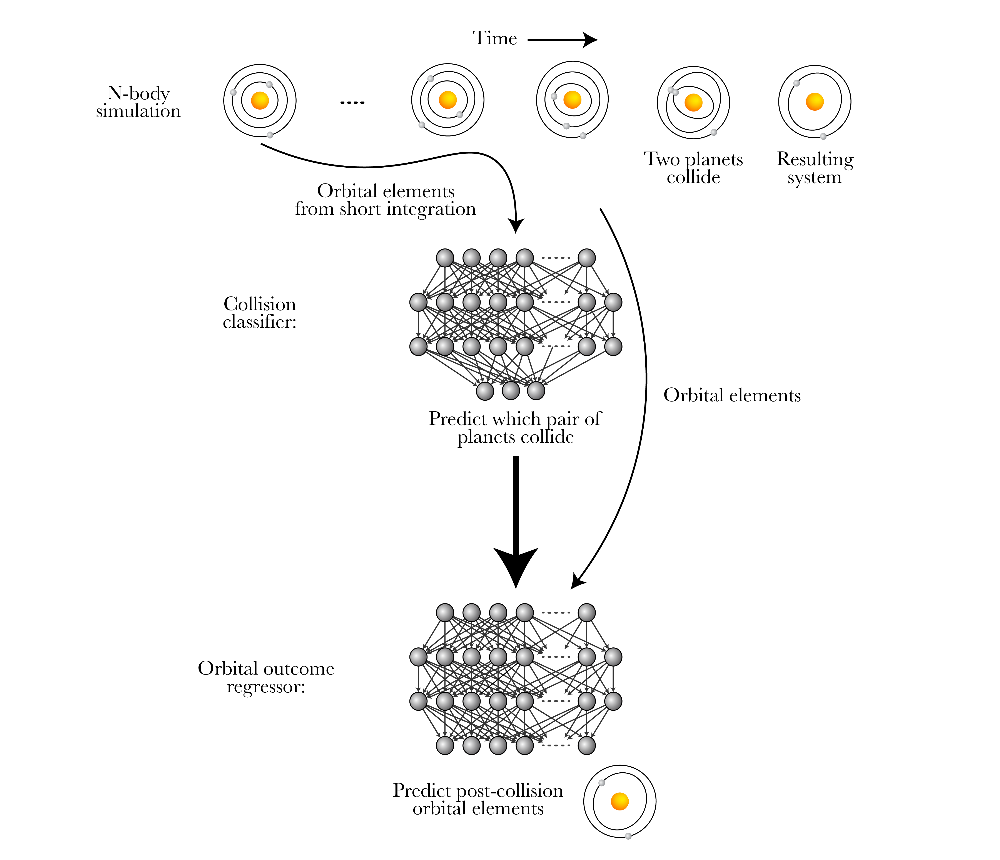

# [Accelerating Giant Impact Simulations with Machine Learning](https://arxiv.org/abs/???)
This repository contains code and supplementary material for the paper https://arxiv.org/abs/???, including scripts to train the ML models, evaluate their performance, and generate figures.

See [SPOCK](https://github.com/dtamayo/spock) for a user-friendly API that interfaces with the collision classifier and orbital outcome regressor models.

# Training dataset
Our full dataset of 500,000+ N-body simulations is available through Globus.

Simulations are saved as REBOUND SimulationArchive objects (see [Rein & Tamayo 2017](https://arxiv.org/abs/1701.07423)) consisting of 100 equally-spaced snapshots of the system over a short 10,000 orbit integration and a snapshot of the final post-collision system. See x for an example of how to access data...

# Contact
Free free to contact me at caleb [dot] lammers [at] princeton [dot] edu if you have questions/comments.